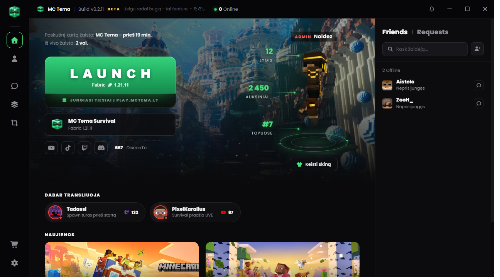

<div align="center">


# MC Tema Launcher

Official desktop launcher for the [MC Tema](https://mctema.lt) Minecraft server - `play.mctema.lt`

[](https://github.com/Noldez/MCTemaLauncher/actions/workflows/ci.yml)
[](https://github.com/Noldez/MCTemaLauncher/actions/workflows/codeql.yml)
[](LICENSE)
[](https://mctema.lt)

**[Download for players -> mctema.lt](https://mctema.lt)**



</div>

## Features

- **One-click play** - installs Minecraft 1.21.11 + Fabric with a bundled Java 21 runtime and joins the server automatically
- **MC Tema account login** - credentials verified over certificate-pinned TLS, stored encrypted with Windows DPAPI
- **Friends & chat** - live presence, direct messages with image support, launcher-native notifications
- **Screenshot gallery** - browse local shots, submit the best ones to the community gallery on mctema.lt
- **Skin locker** - local skin collection with live 3D preview
- **Optional mods** - Sodium, Lithium, Iris and more, installed from Modrinth with checksum verification on every launch
- **Automatic updates** - silent download, one-click install

## Why open source

So players can verify what the launcher does. It talks only to `mctema.lt`, official Mojang/Fabric/Modrinth endpoints and `mc-heads.net` - nothing else. Client mods are hash-verified before every launch. Releases are built from this source with published SHA-256 checksums.

Found something off? See [SECURITY.md](SECURITY.md).

## Development

```
npm install
npm run download-jre   # fetch Temurin JRE 21 into assets/jre
npm start
```

Build the Windows installer with `npm run dist` (NSIS, output in `build/`). Game files live in `%APPDATA%\.mctema`.

Contributions welcome - see [CONTRIBUTING.md](CONTRIBUTING.md).

## License

Code is licensed under [GPL-3.0](LICENSE). MC Tema branding, logos and artwork are **not** covered by the code license and may not be reused.

Icons by [game-icons.net](https://game-icons.net) (CC BY 3.0) and Font Awesome Free.
