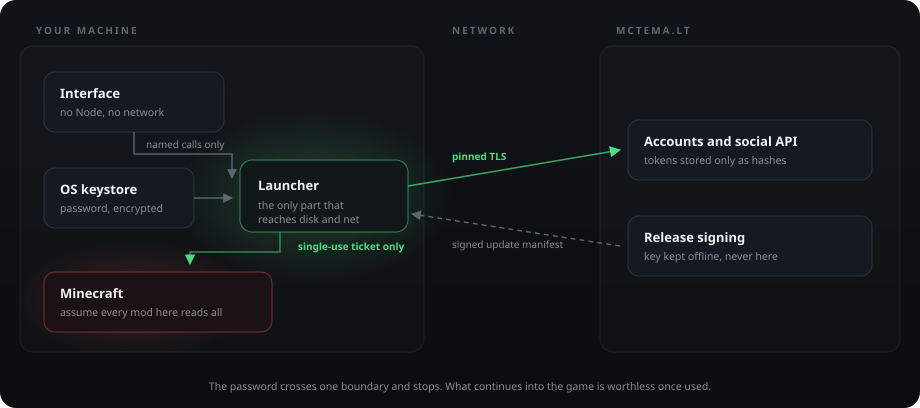
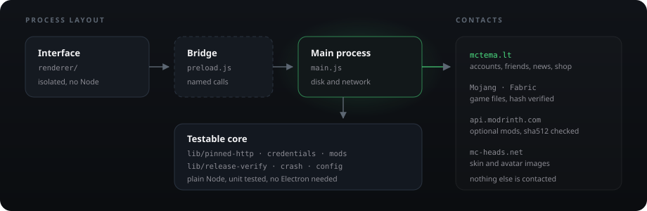
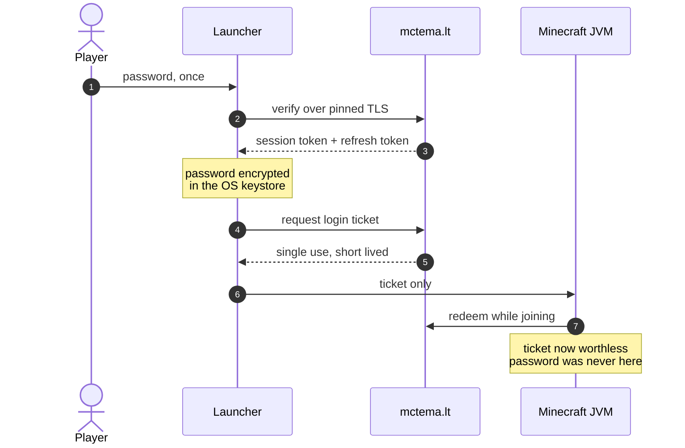

<div align="center">


# MC Tema Launcher

**Official desktop launcher for the [MC Tema](https://mctema.lt) Minecraft server**

One click installs Minecraft, Fabric and Java, signs you in and drops you on `play.mctema.lt`.

[](https://github.com/Noldez/MCTemaLauncher/actions/workflows/ci.yml)
[](https://github.com/Noldez/MCTemaLauncher/actions/workflows/codeql.yml)
[](https://github.com/Noldez/MCTemaLauncher/releases/latest)
[](https://github.com/Noldez/MCTemaLauncher/releases)
[](https://scorecard.dev/viewer/?uri=github.com/Noldez/MCTemaLauncher)
[](https://www.bestpractices.dev/projects/13924)
[](LICENSE)
[](https://mctema.lt)

### [**Download →**](https://mctema.lt)

<sub>[Features](#features) · [Install](#install) · [Security](#security) · [How it works](#how-it-works) · [Troubleshooting](#troubleshooting) · [Development](#development)</sub>


</div>

---

## Features

| | |
|---|---|
| **One-click play** | Installs Minecraft 1.21.11 + Fabric with a bundled Java 21 runtime and joins the server automatically |
| **Account login** | Verified over certificate-pinned TLS, stored in the OS keystore - DPAPI on Windows, libsecret or kwallet on Linux |
| **Friends & chat** | Live presence, direct messages with images, native notifications |
| **Server news** | The latest posts from mctema.lt on the home screen |
| **Shop** | Ranks, keys and cosmetics bought with auksiniai without leaving the launcher |
| **Screenshot gallery** | Browse local shots, submit the best to the community gallery |
| **Skin locker** | Local skin collection with a live 3D preview |
| **Optional mods** | Sodium, Lithium, Iris and more from Modrinth, checksum-verified on every launch |
| **In-game features** | Server settings in the pause menu, tab-list badges, Residence claim previews |
| **Crash help** | Names the likely culprit and offers to send the log, so tickets arrive with evidence |
| **Deep links** | `mctema://` links from the website open the launcher, start the game or add a friend |
| **Automatic updates** | Silent download, one-click install - and nothing installs without our release signature |

## Install

<details open>
<summary><b>Windows</b></summary>

Download the installer from **[mctema.lt](https://mctema.lt)** and run it. Windows 10 or 11, 64-bit.

> [!WARNING]
> The installer is not code-signed yet ([#5](https://github.com/Noldez/MCTemaLauncher/issues/5)), so SmartScreen may warn on first run. Verify it instead of trusting the prompt:
>
> ```
> SHA-256  f4008fa041599eec0f66ce30dbef184cc669358aacd0814f02378172467c1aac
> ```
>
> [VirusTotal](https://www.virustotal.com/gui/file/f4008fa041599eec0f66ce30dbef184cc669358aacd0814f02378172467c1aac) reports 0/62 detections. Then choose **More info → Run anyway**.

</details>

<details>
<summary><b>Linux</b> - .deb recommended, AppImage available</summary>

**Debian, Ubuntu, Kali, Mint.** No FUSE needed, adds a normal menu entry:

```bash
sudo apt install ./MCTemaLauncher-*.deb
mctema-launcher
```

**Everything else** - the AppImage:

```bash
chmod +x MCTemaLauncher-*.AppImage
./MCTemaLauncher-*.AppImage
```

On distros that dropped FUSE 2 (Kali, newer Arch and Ubuntu) the AppImage must unpack itself instead of mounting - note the double dash:

```bash
./MCTemaLauncher-*.AppImage --appimage-extract-and-run
```

> [!NOTE]
> Credential storage needs a running secret service. The `.deb` pulls in `libsecret`; on a minimal desktop without `gnome-keyring` or `kwallet` the launcher says so rather than storing your password unprotected.

</details>

Every release also ships `SHA256SUMS.txt` and a signed build provenance attestation:

```bash
gh attestation verify MCTemaLauncher-Setup.exe --repo Noldez/MCTemaLauncher
```

## Security

The launcher is open source so this section can be checked rather than believed. Found something? See [SECURITY.md](SECURITY.md).



| Layer | Holds against | How |
|---|---|---|
| **Transport** | Interception, rogue or compelled CA | Every call to `mctema.lt` is refused unless the chain contains a key pinned in [`lib/pinned-http.js`](lib/pinned-http.js). A second CA is pinned as backup so a certificate change cannot lock everyone out, and CAA records stop any other CA issuing for the domain at all. |
| **Identity** | Credential theft, replay | Password verified server-side against AuthMe, then never sent again. Tokens are 32 random bytes and the server keeps only their SHA-256, so a database leak yields nothing usable. Refresh tokens are single-use: one seen twice means a copy is circulating, so the whole login is revoked. Theft becomes visible instead of silent. Logging out retires the token server-side, and changing your password in game kills every session you have. |
| **Authorization** | Privilege crossing between surfaces | Tokens are scoped. The one handed to the game reaches the presence beat and nothing else, so stealing it buys the ability to look like you are playing. Prices and balances are decided server-side; the client sends the price it displayed only so the server can refuse when they disagree. |
| **Supply chain** | Malicious update or mod | Updates install only when a manifest signed with an offline key vouches for that exact version and hash. Optional mods are checked against Modrinth's SHA-512 and Minecraft files against Mojang's hashes before anything loads as code. Bundled client mods are re-hashed on every launch, not just at install. |
| **Local process** | A bug in our own UI | The interface runs with no Node and no network, reaches the rest only through named IPC, and cannot navigate away from the bundled page. Values read back from settings are validated before they touch a filesystem path, because that file is writable by anything running as you. |
| **Data at rest** | Someone reading files off the disk | Credentials go through the OS keystore, DPAPI or libsecret. On Linux the launcher refuses to save rather than fall back to Chromium's `basic_text` backend, which "encrypts" with a key anyone can look up. |
| **Abuse** | A modified client hammering the API | Per-account limits on the endpoints that cost us something. The thresholds are not published, for the same reason you do not print the alarm code on the door. |
| **Telemetry** | Us collecting things you did not agree to | There is none. The one exception is manual: after a crash you can press *Siųsti logą*, and even then the log has your account name and home path stripped out before it leaves. |

### Not covered

Worth being straight about, since a list that claims everything is worth nothing.

- **Anyone with administrator access to your machine.** They can read the keystore, patch the launcher, or just install a keylogger. No client-side control survives that.
- **Code signing.** The installer is unsigned ([#5](https://github.com/Noldez/MCTemaLauncher/issues/5)), so SmartScreen has no reputation to go on and you verify by checksum instead. This is the gap we would close first.
- **A CA inside the CAA set being compromised** and issuing a certificate that also matches a pinned root. Pinning narrows this to two authorities, it does not eliminate it.
- **Whatever is already on your account.** If someone knows your password, the launcher is not what stops them; change it in game and every session dies with it.


## How it works



<details>
<summary><b>The three processes</b></summary>

`main.js` is the Electron main process and the only part with filesystem and network access. `renderer/` is the UI, running with `nodeIntegration: false` and `contextIsolation: true`, so page code cannot reach Node at all. Everything between them crosses `preload.js`, which exposes one narrow `window.api` of named IPC calls - if a capability is not listed there, the UI does not have it.

`lib/` holds the parts worth reading on their own: `pinned-http.js` (every call to our API), `credentials.js` (what touches your password), `mods.js` (integrity checks), `release-verify.js` (update signatures), plus `config.js`, `crash.js` and `mc-status.js`. All unit-tested, none need Electron to run.

</details>

<details>
<summary><b>Logging in, and why the password never reaches the game</b></summary>



Your password goes to `mctema.lt/api/launcher/login` over a pinned connection and is checked against the server's AuthMe database - the same account you use in game. The server returns a session token plus a refresh token, and staying signed in afterwards uses the refresh token, so **the password is not sent again**.

The launcher does *not* hand Minecraft your password. Anything loaded into that JVM can read its environment, including mods you installed yourself, so the password would be the one credential a hostile mod could simply pick up. Instead the launcher requests a one-shot login ticket - one nickname, one use, five minutes - and passes only that. The client mod sends it through the encrypted handshake and the server redeems it, after which it is worthless. If a ticket cannot be issued the game still starts and you type `/login` once.

The password stays encrypted in `auth.dat` so you are not asked every time: it signs you in and stands in when there is no usable refresh token. It never leaves the launcher.

</details>

<details>
<summary><b>Launching the game</b></summary>

Before every launch the bundled client mods are hashed against known values and the mods folder is rebuilt from scratch. A mismatch aborts the launch rather than joining the server with modified code. The game then runs on the bundled Temurin JRE 21 with a Fabric profile and connects straight to `play.mctema.lt`.

```mermaid
flowchart LR
    A["New version<br/>advertised"] --> B["Installer downloaded<br/>ordinary TLS"]
    B --> C["Release manifest fetched<br/>pinned TLS"]
    C --> D{"Signed by our<br/>offline key?<br/>Version and hash<br/>both match?"}
    D -->|yes| E["Install"]
    D -->|no| F["Delete<br/>and report"]

    style E fill:#1f3b25,stroke:#3a6
    style F fill:#3b1f1f,stroke:#a33
```

</details>

<details>
<summary><b>Updating</b></summary>



Two independent paths have to agree: rewriting the download is not enough without the key, and the key is not on the server.

`electron-updater` checks `mctema.lt/updates/` every 15 minutes. That download deliberately uses ordinary TLS rather than our pins, so a mistake in the pin list stays recoverable by shipping a fix. Because it does, the trust comes from elsewhere: the launcher fetches a release manifest signed with an offline key over the **pinned** connection, hashes the installer it just downloaded, and installs only if the signature covers exactly that version and hash. Anything else is deleted.

</details>

<details>
<summary><b>Everything it contacts</b></summary>

`mctema.lt` for accounts, friends, chat, news, shop and the gallery; Mojang (`launchermeta`, `launcher`, `libraries`, `resources.download`) and `meta.fabricmc.net` for game files; `api.modrinth.com` for optional mods; `mc-heads.net` for skin and avatar images.

Grepping the source for `https://` returns a few more, and it is worth saying why rather than leaving you to wonder. `discord.gg`, `youtube.com` and `twitch.tv` are links handed to your browser, never fetched by the launcher. `files.minecraftforge.net`, `search.maven.org`, `github.com` and `help.minecraft.net` live in [`lib/mclc/`](lib/mclc), the vendored copy of minecraft-launcher-core, on Forge code paths this launcher does not use - kept so the fork stays close to upstream.

</details>

## Troubleshooting

<details>
<summary><b>Windows warns about the file</b></summary>

The installer is not code-signed yet, so fresh builds have no reputation with SmartScreen. Verify the checksum and VirusTotal scan under [Install](#install), then choose **More info → Run anyway**.

</details>

<details>
<summary><b>Linux: <code>dlopen(): error loading libfuse.so.2</code></b></summary>

Kali, newer Ubuntu and Arch no longer ship FUSE 2, which the AppImage needs to mount itself. Install the `.deb` instead, or run the AppImage so it unpacks itself:

```bash
./MCTemaLauncher-*.AppImage --appimage-extract-and-run
```

</details>

<details>
<summary><b>Linux: "Nerasta saugi raktinė (gnome-keyring arba kwallet)"</b></summary>

No secret service is running, so there is nowhere safe to keep your password. The launcher refuses rather than falling back to Chromium's `basic_text` backend, which "encrypts" with a key anyone can look up. Install and start `gnome-keyring` or `kwallet`; the `.deb` already pulls in `libsecret`. Standard desktops have one running.

</details>

<details>
<summary><b>The 3D character does not appear</b></summary>

Virtual machines usually have no GPU and their display adapters are on Chromium's WebGL blocklist. The launcher falls back to software rendering, and to a flat 2D skin if even that is unavailable. Everything else works normally either way.

</details>

<details>
<summary><b>"Nepavyko pasiekti mctema.lt"</b></summary>

A network hiccup, common on VM NAT or right after waking from sleep. Read-only requests retry automatically; press refresh if it persists.

</details>

<details>
<summary><b>"Saugumo klaida: nepatikimas sertifikatas"</b></summary>

The launcher pins the public keys behind `mctema.lt` and refused a certificate that did not match. That is what an intercepted connection looks like, so treat it seriously: check whether you are on a network that inspects traffic, such as some corporate or school wifi. If you are not, please [report it](SECURITY.md). It can also mean our certificate authority changed and the pins need updating - our bug, not yours.

</details>

<details>
<summary><b>Updating the Linux .deb asks for a password</b></summary>

Installing a `.deb` requires root, so the updater elevates. The AppImage updates without any prompt.

</details>

## Development

```bash
npm install
npm run download-jre         # Temurin JRE 21 into assets/jre (Windows)
npm start
```

| Command | Purpose |
|---|---|
| `npm run lint` | ESLint |
| `npm test` | `node --test` |
| `npm run typecheck` | `tsc --noEmit` over `lib/` and `scripts/` |
| `npm run check-pins` | Verify `mctema.lt` still matches a pinned certificate |
| `npm run dist` | Windows installer (NSIS), output in `build/` |
| `npm run dist-linux` | Linux AppImage and `.deb` |

The first three run in CI and gate every pull request. Game files live in `%APPDATA%\.mctema` on Windows and `~/.config/.mctema` on Linux. `lib/mclc/` is a vendored fork of minecraft-launcher-core, deliberately kept close to upstream.

Contributions welcome - see [CONTRIBUTING.md](CONTRIBUTING.md).

<details>
<summary><b>Publishing a release</b></summary>

Updates are verified against a manifest signed with an offline Ed25519 key; the public half lives in [`lib/release-verify.js`](lib/release-verify.js).

```bash
npm run dist
MCTEMA_SIGNING_KEY=/path/to/release-key.pem \
  node scripts/sign-release.js build/MCTemaLauncher-Setup-<version>.exe
# upload the installer, its .blockmap, latest.yml and manifest-<version>.json
```

> [!IMPORTANT]
> The private key never belongs on the server or in this repository. Hash the artifacts on the machine holding the key - a signature over hashes computed by the server that serves the files proves nothing. Skip the manifest and launchers will download the update, fail verification and silently stay put.

</details>

## License

Code is licensed under [GPL-3.0](LICENSE). MC Tema branding, logos and artwork are **not** covered by the code license and may not be reused.

Icons by [game-icons.net](https://game-icons.net) (CC BY 3.0) and Font Awesome Free.
