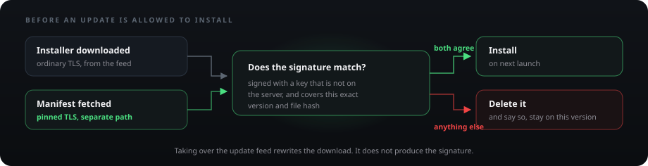

<div align="center">


# MC Tema Launcher

**Official desktop launcher for the [MC Tema](https://mctema.lt) Minecraft server**

One click installs Minecraft, Fabric and Java, signs you in and drops you on `play.mctema.lt`.

[](https://github.com/Noldez/MCTemaLauncher/actions/workflows/ci.yml)
[](https://github.com/Noldez/MCTemaLauncher/actions/workflows/codeql.yml)
[](https://github.com/Noldez/MCTemaLauncher/releases/latest)
[](https://github.com/Noldez/MCTemaLauncher/releases)
[](https://scorecard.dev/viewer/?uri=github.com/Noldez/MCTemaLauncher)
[](https://www.bestpractices.dev/projects/13924)
[](LICENSE)
[](https://mctema.lt)

### [**Download →**](https://mctema.lt)

<sub>[Features](#features) · [Install](#install) · [Security](#security) · [How it works](#how-it-works) · [Troubleshooting](#troubleshooting) · [Development](#development)</sub>


</div>

---

## Features

| | |
|---|---|
| **One-click play** | Installs Minecraft 1.21.11 + Fabric with a bundled Java 21 runtime and joins the server automatically |
| **Account login** | Verified over certificate-pinned TLS, stored in the OS keystore - DPAPI on Windows, libsecret or kwallet on Linux |
| **Register in the launcher** | Create an account without joining the server first, rate limited per connection |
| **Relay** | Direct messages and group chats: replies, edits, read receipts, typing, pinned conversations, image drops and link previews |
| **Server news** | The latest posts from mctema.lt on the home screen |
| **Shop** | Ranks, keys and cosmetics bought with auksiniai without leaving the launcher |
| **Screenshot gallery** | Browse local shots, submit the best to the community gallery |
| **Locker** | Skin collection with a live 3D preview, and 59 capes - animated ones included - that render in game through our client |
| **Optional mods** | Sodium, Lithium, Iris and more from Modrinth, checksum-verified on every launch |
| **In-game features** | Server settings in the pause menu, tab-list badges, Residence claim previews |
| **Crash help** | Names the likely culprit and offers to send the log, so tickets arrive with evidence |
| **Deep links** | `mctema://` links from the website open the launcher, start the game or add a friend |
| **Automatic updates** | Silent download, one-click install - and nothing installs without our release signature |

## Install

**Windows 10 or 11, 64-bit.** Download the installer from [mctema.lt](https://mctema.lt) and run it.

> [!CAUTION]
> The installer is not code-signed yet ([#5](https://github.com/Noldez/MCTemaLauncher/issues/5)), so SmartScreen may warn on first run. Verify it rather than trusting the prompt - SHA-256 `f4008fa041599eec0f66ce30dbef184cc669358aacd0814f02378172467c1aac`, and [VirusTotal](https://www.virustotal.com/gui/file/f4008fa041599eec0f66ce30dbef184cc669358aacd0814f02378172467c1aac) reports 0/62. Then **More info → Run anyway**.

**Linux.** The `.deb` is the recommended route on Debian, Ubuntu, Kali and Mint - no FUSE, normal menu entry:

```bash
sudo apt install ./MCTemaLauncher-*.deb && mctema-launcher
```

Everywhere else, the AppImage. Distros that dropped FUSE 2 need it to unpack itself instead of mounting, hence the double dash:

```bash
chmod +x MCTemaLauncher-*.AppImage
./MCTemaLauncher-*.AppImage --appimage-extract-and-run
```

Credential storage needs a running secret service. The `.deb` pulls in `libsecret`; without `gnome-keyring` or `kwallet` the launcher says so rather than storing your password unprotected.

Every release ships `SHA256SUMS.txt` and a build provenance attestation: `gh attestation verify MCTemaLauncher-Setup.exe --repo Noldez/MCTemaLauncher`.

## Security

Open source so this can be checked rather than believed. Found something? [SECURITY.md](SECURITY.md).


| Layer | Holds against | How |
|---|---|---|
| **Transport** | Interception, rogue or compelled CA | Every call to `mctema.lt` is refused unless the chain contains a key pinned in [`lib/pinned-http.js`](lib/pinned-http.js). A second CA is pinned as backup so a certificate change cannot lock everyone out, and CAA records stop any other CA issuing for the domain at all. |
| **Identity** | Credential theft, replay | Password verified server-side against AuthMe, then never sent again. Tokens are 32 random bytes and the server keeps only their SHA-256, so a database leak yields nothing usable. Refresh tokens are single-use: one seen twice means a copy is circulating, so the whole login is revoked. Logging out retires the token server-side, and changing your password in game kills every session you have. |
| **Authorization** | Privilege crossing between surfaces | Tokens are scoped. The one handed to the game reaches the presence beat and nothing else, so stealing it buys the ability to look like you are playing. Prices and balances are decided server-side; the client sends the price it displayed only so the server can refuse when they disagree. |
| **Supply chain** | Malicious update or mod | Updates install only when a manifest signed with an offline key vouches for that exact version and hash. Optional mods are checked against Modrinth's SHA-512 and Minecraft files against Mojang's hashes before anything loads as code. Bundled client mods are re-hashed on every launch, not just at install. |
| **Local process** | A bug in our own UI | The interface runs with no Node and no network, reaches the rest only through named IPC, and cannot navigate away from the bundled page. Values read back from settings are validated before they touch a filesystem path, because that file is writable by anything running as you. |
| **Data at rest** | Someone reading files off the disk | Credentials go through the OS keystore, DPAPI or libsecret. On Linux the launcher refuses to save rather than fall back to Chromium's `basic_text` backend, which "encrypts" with a key anyone can look up. |
| **Abuse** | A modified client hammering the API | Per-account limits on the endpoints that cost us something. The thresholds are not published, for the same reason you do not print the alarm code on the door. |
| **Telemetry** | Us collecting things you did not agree to | There is none. The one exception is manual: after a crash you can press *Siųsti logą*, and even then the log has your account name and home path stripped out before it leaves. |

**Not covered**, since a list that claims everything is worth nothing. Anyone with administrator access to your machine can read the keystore or patch the launcher, and no client-side control survives that. The installer is unsigned, so you verify by checksum instead. Pinning narrows certificate issuance to two authorities rather than eliminating the risk. And if someone already knows your password, the launcher is not what stops them - change it in game and every session dies with it.

## How it works


`main.js` is the only part with filesystem and network access. The UI runs with `nodeIntegration: false` and `contextIsolation: true`, so page code cannot reach Node, and everything between them crosses `preload.js` as named IPC calls. If a capability is not listed there, the UI does not have it. The logic worth reading on its own lives in `lib/` - pinned HTTP, credentials, mod integrity, update signatures, crash handling - all unit-tested and none of it needing Electron to run.

**Logging in.** Your password goes to the API over a pinned connection and is checked against the server's AuthMe database, the same account you use in game. You get a session token and a refresh token back, and staying signed in uses the refresh token, so the password is not sent again. It stays encrypted in `auth.dat` for the next launch and never leaves the launcher.

**Signing you in to the game.** Minecraft never gets your password. Anything loaded into that JVM can read its environment, including mods you installed yourself, so the password would be the one credential a hostile mod could simply pick up. The launcher requests a one-shot ticket instead - one nickname, one use, five minutes - and passes only that. If a ticket cannot be issued the game still starts and you type `/login` once.

**Launching.** Bundled client mods are hashed against known values and the mods folder is rebuilt from scratch every launch. A mismatch aborts rather than joining with modified code.

**Updating.**



`electron-updater` checks the feed every 15 minutes. That download deliberately uses ordinary TLS rather than our pins, so a mistake in the pin list stays recoverable by shipping a fix - which is exactly why the trust comes from the signature instead.

## Troubleshooting

**Windows warns about the file.** No code signature yet, so fresh builds have no reputation. Verify the checksum above, then *More info → Run anyway*.

**`dlopen(): error loading libfuse.so.2`.** Kali, newer Ubuntu and Arch dropped FUSE 2. Install the `.deb`, or run the AppImage with `--appimage-extract-and-run`.

**"Nerasta saugi raktinė".** No secret service is running, so there is nowhere safe to keep your password. The launcher refuses rather than falling back to Chromium's `basic_text` backend, which "encrypts" with a key anyone can look up. Start `gnome-keyring` or `kwallet`.

**The 3D character is missing.** Virtual machines usually have no GPU and land on Chromium's WebGL blocklist. It falls back to software rendering, then to a flat 2D skin. Everything else works normally.

**"Nepavyko pasiekti mctema.lt".** A network hiccup, common on VM NAT or after waking from sleep. Reads retry themselves; press refresh if it persists.

**"Saugumo klaida: nepatikimas sertifikatas".** A certificate that did not match our pins. That is what an intercepted connection looks like, so treat it seriously - check whether you are on a network that inspects traffic, and if you are not, [report it](SECURITY.md). It can also mean our CA changed and the pins need updating, which is our bug.

**Updating the `.deb` asks for a password.** Installing a `.deb` needs root. The AppImage updates without prompting.

## Development

```bash
npm install
npm run download-jre   # Temurin JRE 21 into assets/jre
npm start
```

| Command | Purpose |
|---|---|
| `npm run lint` | ESLint |
| `npm test` | `node --test` |
| `npm run typecheck` | `tsc --noEmit` over `lib/` and `scripts/` |
| `npm run check-pins` | Verify `mctema.lt` still matches a pinned certificate |
| `npm run dist` | Windows installer (NSIS), output in `build/` |
| `npm run dist-linux` | Linux AppImage and `.deb` |

The first three run in CI and gate every pull request. Game files live in `%APPDATA%\.mctema` on Windows and `~/.config/.mctema` on Linux. `lib/mclc/` is a vendored fork of minecraft-launcher-core, kept close to upstream on purpose. Contributions welcome - see [CONTRIBUTING.md](CONTRIBUTING.md).

**Publishing a release.** Build, sign, then upload the installer, its `.blockmap`, `latest.yml` and `manifest-<version>.json`:

```bash
npm run dist
MCTEMA_SIGNING_KEY=/path/to/release-key.pem \
  node scripts/sign-release.js build/MCTemaLauncher-Setup-<version>.exe
```

> [!CAUTION]
> The signing key never belongs on the server or in this repository, and the artifacts must be hashed on the machine holding it - a signature over hashes computed by the server that serves the files proves nothing. Forget the manifest and launchers will download the update, fail the check and quietly stay where they are.

## License

Code is licensed under [GPL-3.0](LICENSE). MC Tema branding, logos and artwork are **not** covered by the code license and may not be reused.

Icons by [game-icons.net](https://game-icons.net) (CC BY 3.0) and Font Awesome Free.
